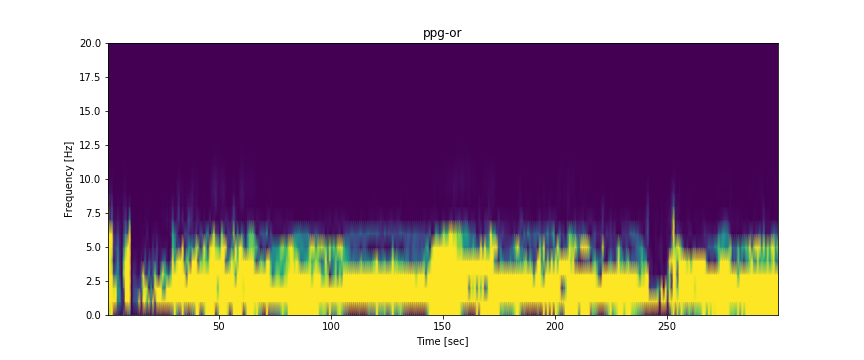
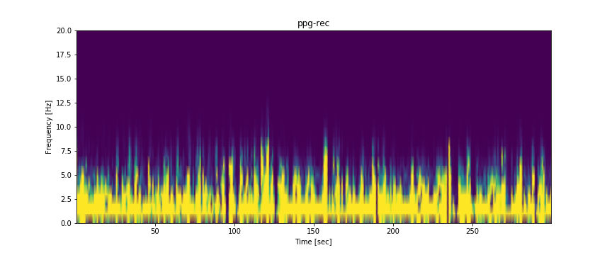
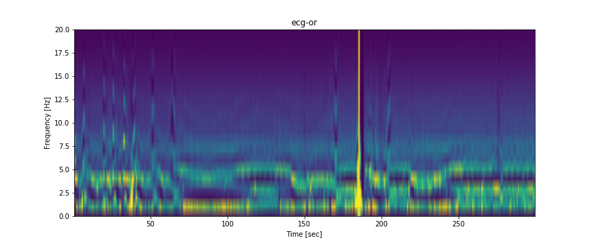
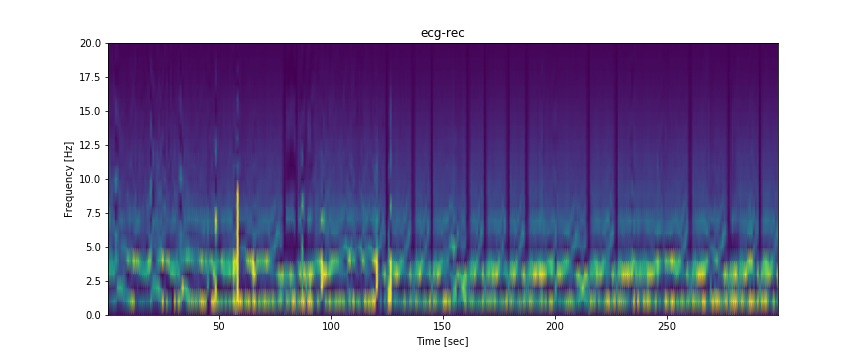

# ppg2nrs
Pre&amp;Post-op ppg > NRS (post-op, in PACU)

## Input

Pre-op(5Min after NIBP(non-invasive blood pressure))
- ECG
- PPG
Post-op(5Min)
- ECG
- PPG

## Output

|  label(pain)  |   nrs |
|---:|-------:|
|  0 |    0~3 |
|  1 |    4~9 |

## Preprocessing

sample_rate: 300Hz

### PPG

- interpolate (constant)
- Bandpass filter (0.5~15)
- Moving average (30taps)
(- z-score)
- Resampling (to set 90000)
- Spectrogram

### ECG

- interpolation (constant)
- elgendi preprocessing

## Spectogram for ECG and PPG (of pre/post-op)

- ppg 


- ecg



# Data

- label  
0: no-milf psin, 1: moderate-severe pain

|    |   nrs2 |
|---:|-------:|
|  0 |    545 |
|  1 |    116 |

# Data Version History

## v1 
======== x: big vital files 
- vital files paths 모두 추출 (#1)
======== y: label file (회복간호_21상, 회복간호_21하, 회복간호_22상)
-통합(df), 
- nrs없는 항목 제거,
- (등록번호, 회복실퇴실날짜) 중복 시 제거
- '등록번호','회복실퇴실일시','최대 NRS','KEY' 항목들만 추출
- 회복실퇴실일시> time, date 추출 (time, date를 key처럼 사용 (vital file 추출 용이))
    - df: ['등록번호','date','time','최대 NRS','KEY']
    - df: ['pt_id', 'date', 'time', 'max_nrs','key']

- #1를 이용하여 df의 해당하는 vital이 없을 경우 삭제
    - df: 'idx', 'label', 'vital', 'path', 'nrs', 'key', 'ext_path', 'room', 'path_0'
- 섞여있는 필요한 데이터를 path를 이용하여 알맞게 복사 (#data moving)
- 해당 수술에 대한 pdor과 pdrec을 매칭시켜 저장 (df > json) #json scheme
======== #data moving  
- 사용되는 흩어진 데이터 > pdor/*, pdrec/*에 복사 (18GB, 약 1600pair)  
// 파일의 이름을 이용하여 pdor, pdrec 구별 
======== #json scheme  
item[N]: 'key', 'rec_path', 'or_path', 'nrs'
key: 해당 key는 raw data(회복간호*.csv) 기재된 키. 이를 통해 환자의 다른 메타정보를 추적할 수 있음.  
rec_path: 회복실 vital file paths  
or_path: 수술시 vital file paths   
nrs: (numeric rating score) 정답 라벨 // 통증의 정도를 0~10범위로 표현, 회복실에서 측정됨.   

======== Final Scheme  
./pdrec/* (# data moving)  
./pdor/*   
./all.json (# json scheme)  

## v1.5

- +demographic data (gender, age)


======== Final Scheme  

./pdrec/* (# data moving)  
./pdor/*
./all_1.json

## v3

- Applied Filter4
    1. NRS? 
    2. pdor&pdrec pair? 
    3. General Anesthesia? 
    4. Gynecology dept.?

======== Final Scheme
./pdrec/* (# data moving)  
./pdor/*
./all_2.json

======== Data DESC.  
About label  
no-mild: moderate-severe = 545:116 ≓ 4.5:1

## v4

- Applied Filter4
    1. NRS? 
    2. pdor&pdrec pair? 
    3. General Anesthesia? 
    4. Gynecology dept.?  
    5. __Data Quality? (Non-existing, too many null, …)__ (black list)

======== Final Scheme  
./all_3.json  
../data/all_3/*.npy  

./train_3.json  
./val_3.json  
./test_3.json  


black list 
```python 
black_list = ['01826958_PDOR1_210421_124500_1',
              '01853529_PDOR1_210419_083500_1',
              '01876359_PDOR2_210602_083200_1',
              '01656320_PDOR2_210526_091300_1',
              '01618678_PDOR1_210615_083000_1',
              '01159584_PDOR1_211025_083400_1',
              '00578148_PDOR2_210805_111500_1',
              '01853408_PDOR1_211115_083100_1',
              '01906040_PDOR1_210831_110500_1',
              '00435676_PDREC02_210902_093500_1', # dataset 
              '01060037_PDOR2_211206_102000_1', #  Filling missing values error
              '01929835_PDOR2_211102_093000_1',
              '01392754_PDOR2_220111_105500_1',
              '01439205_PDOR2_211206_121100_1', # in dl, fmissing
              '00435676_PDOR1_210902_084000_1'
             ]
```
